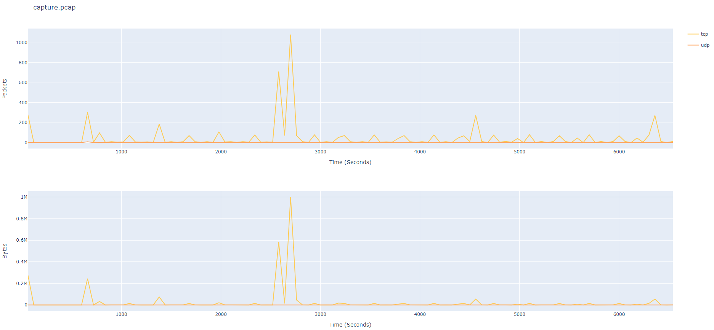

# pcap-iograph-plotter

A script to generate I/O graph and csv files containing information about number of packets and bytes for the specified time steps and protocols in pcap file.
Uses tshark for obtaining the infromation and plotly to generate plots.

## Requirements

This script requires the [pandas](https://pandas.pydata.org/) library installed to run and get csv file and [plotly](https://plot.ly/graphing-libraries/) library for graphs.

## Usage

To use the script you either pass a pcap file `(-f)` or list of pcap files `(-l)` as an argument:

    usage: pcap-iograph-plotter.py [-h] (-f FILE | -l LIST)
                                  [-p PROTOCOLS [PROTOCOLS ...]] [-s STEP]
                                  [-t TSHARK] [-c]

    optional arguments:
      -h, --help            show this help message and exit
      -f FILE, --file FILE  Pcap file for which you want to create graphs.
      -l LIST, --list LIST  File containg the list of pcap files for which you
                            want to create graphs.
      -p PROTOCOLS [PROTOCOLS ...], --protocol PROTOCOLS [PROTOCOLS ...]
                            Network protocols hat you want to analyze. Defaults
                            are TCP and UDP.
      -s STEP, --step STEP  Set time step of the graph in seconds. Default is 1
                            second.
      -t TSHARK, --tshark TSHARK
                            Specify path to tshark if it is not in PATH.
      -c, --csv             Generate only CSV file.

## Examples

In the repo you can find example pcap file, which was used for following examples `capture.pcap`.

### Default configuration

To use the basic configuration, which will get you information about TCP and UDP protocol, you simply run:

```shell
pcap-iograph-plotter.py -f [pcap-file]
```

or

```shell
pcap-iograph-plooter.py -l [list-of-pcaps]
```

The output will be graph containg plot for number of packets per time step and plot for number of bytes per time step. Here is exmaple output:



### CSV file only with specific protocols and different step size

To get only csv output for specific protocols (Here TCP and UDP) and change step size to 60 seconds you would run:

```shell
pcap-iograph-plotter.py -f [pcap-file] -p time dns ipv6 ssh telnet irc tls tcp udp http -s 60 -c
```

The location of the csv files is the same as of the `pcap-file` and their name is `pcap-file-packets.csv` and `pcap-file-bytes.csv`. Here is the example content of the csv file:

```csv
time,dns,ipv6,ssh,telnet,irc,tls,tcp,udp,http
1,75,0,0,0,0,0,0,75,0
2,91,0,0,0,0,0,592,91,346
3,0,0,0,0,0,0,13498,0,0
4,0,0,0,0,0,0,267643,0,1397
5,0,0,0,0,0,0,0,0,0
6,0,0,0,0,0,0,0,0,0
7,0,0,0,0,0,0,0,0,0
8,0,0,0,0,0,0,0,0,0
9,0,0,0,0,0,0,0,0,0
10,0,0,0,0,0,0,0,0,0
11,0,0,0,0,0,0,0,0,0
12,0,0,0,0,0,0,0,0,0
13,0,0,0,0,0,0,0,0,0
14,0,0,0,0,0,0,60,0,0
15,0,0,0,0,0,0,0,0,0
16,0,0,0,0,0,0,0,0,0
17,0,0,0,0,0,0,0,0,0
18,0,0,0,0,0,0,0,0,0
19,0,0,0,0,0,0,0,0,0
20,0,0,0,0,0,0,0,0,0
21,0,0,0,0,0,0,0,0,0
```